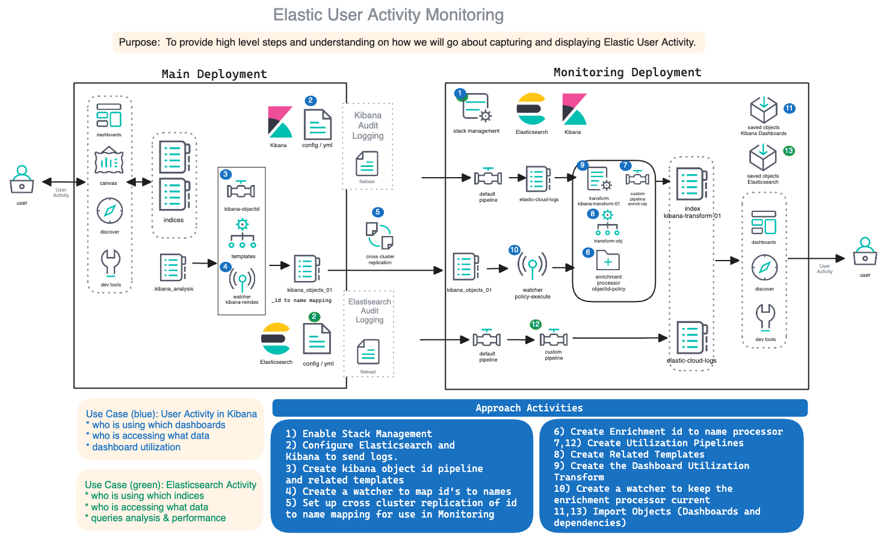

# Elastic Stack UAM Guide

## **Intro**

This contains instructions on the full set of activities to complete the User Activity Monitoring Customer Architecture Play. The approach is broken into Kibana Auditing and Elasticsearch Auditing and documented in such a way that either or both can be delivered.

This guide assumes the following:
* A Platinum or Enterprise Subscription level (https://www.elastic.co/subscriptions) - see rows: Elasticsearch audit logging, Kibana audit logging
* Relevant permissions to access system indices in the cluster
* [Remote Cluster setup](https://www.elastic.co/guide/en/elasticsearch/reference/current/remote-clusters.html) for cluster(s) and the main monitoring cluster
* [Stack monitorig setup](https://www.elastic.co/guide/en/kibana/current/xpack-monitoring.html)
* Audit loging enabled through filbeat and shipped to a monitoring cluster
  - [Kibana Audit logs](https://www.elastic.co/guide/en/kibana/current/xpack-security-audit-logging.html)
  - [Elasticsearch Audit logs](https://www.elastic.co/guide/en/elasticsearch/reference/current/enable-audit-logging.html)
  - Additional [filtering](https://www.elastic.co/guide/en/elasticsearch/reference/current/auditing-settings.html) to reduce log volume

## Deployment Overview

=======
Folders for each deployment mechanism contain a tailored README.md.

 ## **Folder Structure**

### Deployment mechanisms: 

1. **[ECK](./eck/README.md) - standalone filbeat**

Contents:
- Assets to manually deploy Stack UAM / [Slowlogging](https://www.elastic.co/guide/en/elasticsearch/reference/current/index-modules-slowlog.html) in an on-premise environment.

2. **[assets](./assets/)**

Contents:
- Dashboard exports:
   - post8.14-dashboard.ndjdson (Full Stack UAM dashboard collection compatible with versions <= 8.14 )
   - slowlog.ndjsonn (Slowlog-only dashboard)
